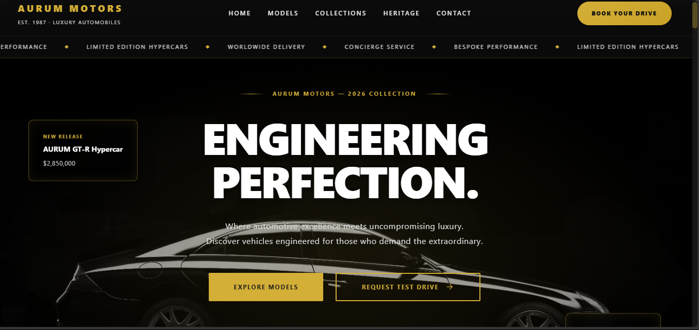
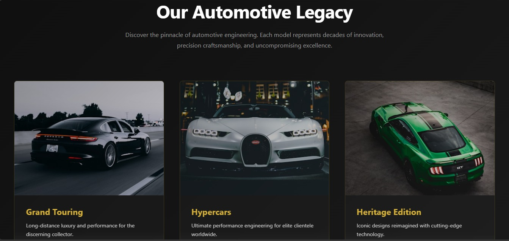
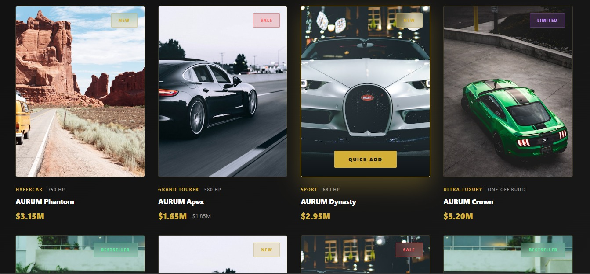
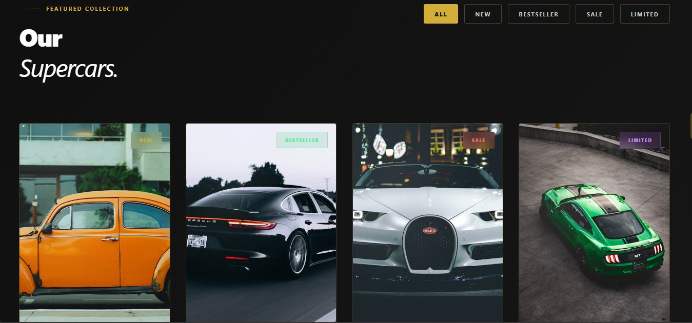

<div align="center">

# 🚗 AURUM MOTORS
### Premium Luxury Automobile Showcase


*Where automotive excellence meets uncompromising luxury.*

</div>

---

## 📸 Preview

### Hero Section


### Supercars Showcase


### Product Cards


### Collections


---

## ✨ Features

- **Hero Section** — Full-screen landing with animated headline, new release badge, and dual CTA buttons
- **Scrolling Ticker** — Marquee banner showcasing services: Limited Edition Hypercars, Worldwide Delivery, Concierge Service, and more
- **Product Cards** — Luxury car listings with badge overlays (NEW / BESTSELLER / SALE / LIMITED), category tags, horsepower specs, and pricing
- **Collections Section** — Editorial-style grid featuring Grand Touring, Hypercars, and Heritage Edition categories
- **Responsive Layout** — Mobile-friendly design that adapts across all screen sizes
- **Elegant Navbar** — Brand identity with smooth navigation links and a prominent CTA button

---

## 🛠️ Technologies Used

| Technology | Purpose |
|---|---|
| React.js | Component-based UI framework |
| JavaScript (ES6+) | Application logic & interactivity |
| CSS3 | Styling, animations & layout |
| HTML5 | Semantic markup |

---

## 📁 Project Structure

```
aurum-store/
├── public/
│   └── index.html
├── src/
│   ├── components/
│   │   ├── Navbar.jsx          # Navigation bar with CTA
│   │   ├── Hero.jsx            # Full-screen hero section
│   │   ├── Categories.jsx      # Automotive legacy collections grid
│   │   ├── ProductCards.jsx    # Supercar listing cards with badges
│   │   ├── Testimonials.jsx    # Customer testimonials section
│   │   └── Footer.jsx          # Site footer
│   ├── App.jsx                 # Root component
│   ├── App.css                 # Global styles
│   └── index.js                # Entry point
├── package.json
└── README.md
```

---

## 🚀 Getting Started

### Prerequisites

Make sure you have **Node.js** (v14+) and **npm** installed on your machine.

### Installation

1. **Clone the repository**
   ```bash
   git clone https://github.com/your-username/aurum-store.git
   cd aurum-store
   ```

2. **Install dependencies**
   ```bash
   npm install
   ```

3. **Start the development server**
   ```bash
   npm start
   ```

4. Open [http://localhost:3000](http://localhost:3000) in your browser.

---

## 🎨 Design Highlights

- **Dark luxury theme** — Deep charcoal/black backgrounds with gold (`#D4A017`) accents
- **Bold typography** — Oversized hero text for maximum visual impact
- **Badge system** — Color-coded overlays: Gold (NEW), Green (BESTSELLER), Red (SALE), Purple (LIMITED)
- **Strikethrough pricing** — Visual discount indicators on sale items
- **Subtle card borders** — Rounded corners with refined spacing for a premium feel

---

## 📦 Available Scripts

| Command | Description |
|---|---|
| `npm start` | Runs the app in development mode |
| `npm run build` | Builds the app for production |
| `npm test` | Launches the test runner |

---

## 🤝 Contributing

Contributions, issues, and feature requests are welcome!

1. Fork the repository
2. Create your feature branch: `git checkout -b feature/AmazingFeature`
3. Commit your changes: `git commit -m 'Add some AmazingFeature'`
4. Push to the branch: `git push origin feature/AmazingFeature`
5. Open a Pull Request

---

## 👤 Author

**Karan Yadav**

- GitHub: [@your-username](https://github.com/your-username)

---

## 📄 License

This project is open source and available under the [MIT License](LICENSE).

---

<div align="center">

Made with ❤️ by Karan Yadav

⭐ Star this repo if you found it helpful!

</div>
